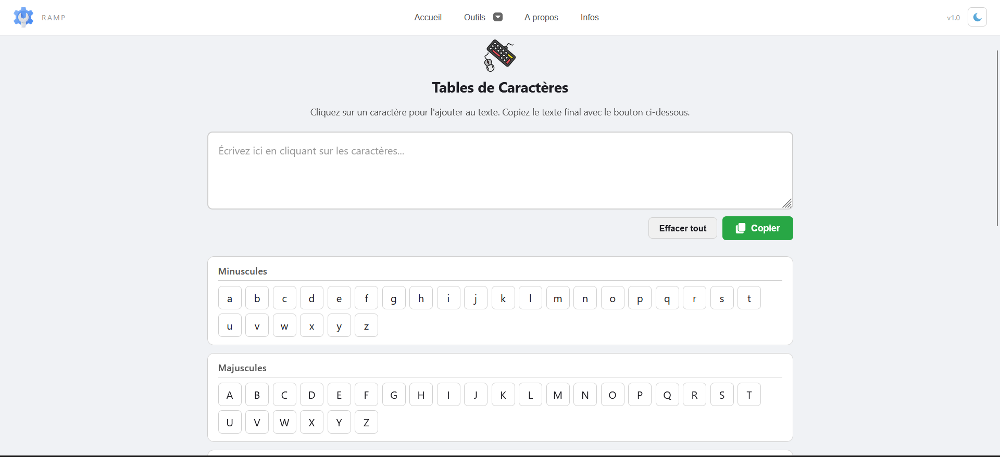
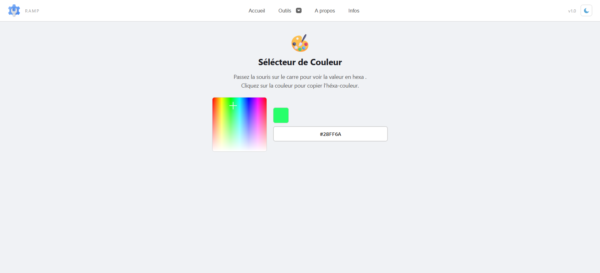

# RAMP - Boîte à Outils

Suite d'utilitaires légers conçus pour les développeurs et administrateurs systèmes à Madagascar.

## À propos

RAMP est une boîte à outils développée pour répondre aux besoins spécifiques de l'écosystème technologique malagasy.
L'application propose des fonctionnalités simples, rapides et accessibles, sans dépendances externes ni surcharge inutile.

## Outils inclus

# RAMP - Boîte à outils

Suite d'utilitaires légers conçus pour les développeurs et administrateurs systèmes à Madagascar.

---

## À propos

RAMP est une boîte à outils développée pour répondre aux besoins spécifiques de l'écosystème technologique malagasy. L'application propose des fonctionnalités simples, rapides et accessibles, sans dépendances externes ni surcharge inutile.

---

## Outils inclus

### Générateur de numéro de téléphone

- Génère des numéros de téléphone conformes à la nomenclature malagasy
- Préfixes disponibles : 032, 033, 034, 037, 038
- Combine un préfixe valide avec sept chiffres aléatoires
- Utile pour le test de formulaires, la validation de champs téléphoniques et la génération de données de test

### Visualiseur de Touches Clavier

- Affiche en temps réel la touche pressée sur le clavier
- Reconnaît les touches spéciales (Ctrl, Shift, Alt, etc.)
- Affiche le code, la key et le which de la touche
- Fonction de verrouillage pour figer l'affichage
- Utile pour le débogage d'événements clavier et l'apprentissage des raccourcis

### Sélecteur de couleur

- Interface visuelle intuitive avec dégradé interactif
- Affichage en temps réel de la valeur hexadécimale
- Copie automatique dans le presse-papiers
- Intégration facile dans les feuilles de style et les maquettes graphiques

## Captures d'écran

### Page d'accueil-clair

### Page d'accueil-sombre

### Générateur de numéro

### Sélecteur de numéro-val

### Clavier Virtuel

### Sélecteur de couleur

---

## Technologies utilisées

- HTML5
- CSS3
- JavaScript (Vanilla)

## Structure du projet

Outils-Ramp/

├── images/ # Images du header et pages statiques

├── outils/ # Modules outils (HTML, JavaScript, images)

│ └── images/ # Images spécifiques aux outils

├── pages/ # Pages statiques

├── ramp.css # Styles principaux

├── ramp.html # Page principale

# └── ramp.js # Logique principale

---

## Structure du projet

Outils-Ramp/

├── captures/ # Captures d'écran

├── images/ # Images du header et pages statiques

├── outils/ # Modules outils (HTML, JavaScript, images)

└── images/ # Images spécifiques aux outils

├── pages/ # Pages statiques

├── ramp.css # Styles principaux

├── ramp.html # Page principale

└── ramp.js # Logique principale

## Auteurs :

Johanès F.

Made in Madagascar 🇲🇬

---
