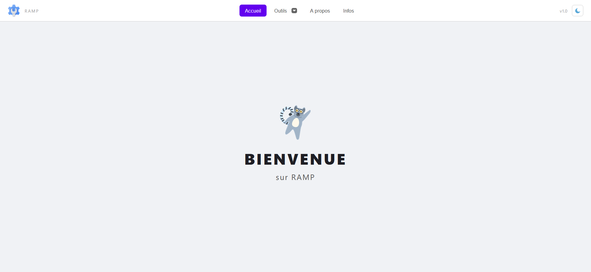
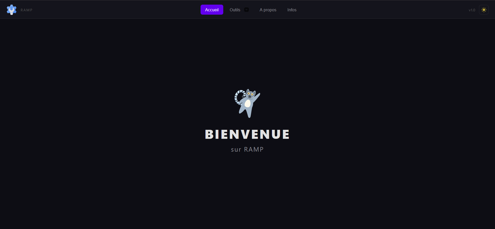
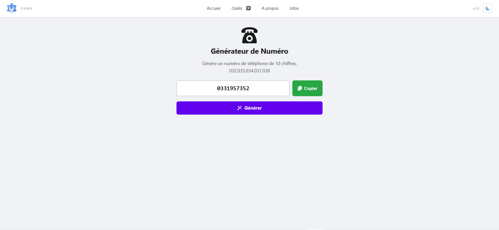
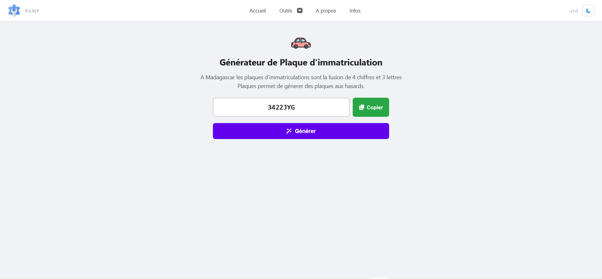
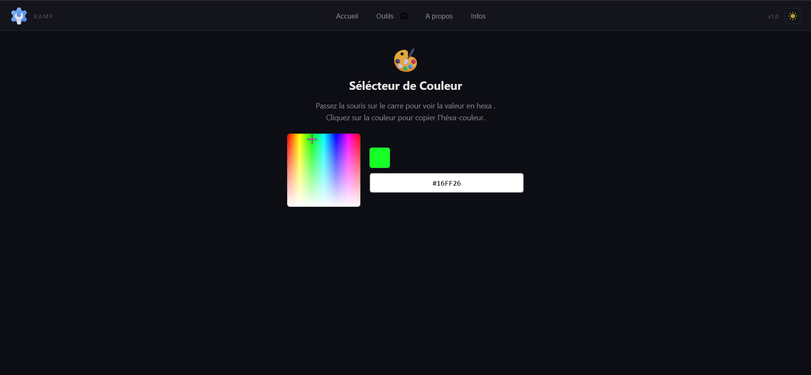

# RAMP - Boîte à outils

Suite d'utilitaires légers conçus pour les développeurs et administrateurs systèmes à Madagascar.

---

## À propos

RAMP est une boîte à outils développée pour répondre aux besoins spécifiques de l'écosystème technologique malagasy. L'application propose des fonctionnalités simples, rapides et accessibles, sans dépendances externes ni surcharge inutile.

---

## Outils inclus

### Générateur de numéro de téléphone
- Génère des numéros de téléphone conformes à la nomenclature malagasy
- Préfixes disponibles : 032, 033, 034, 037, 038
- Combine un préfixe valide avec sept chiffres aléatoires
- Utile pour le test de formulaires, la validation de champs téléphoniques et la génération de données de test

### Générateur de plaque d'immatriculation
- Respecte le format standard malgache : quatre chiffres suivis de trois lettres majuscules
- Modèle : 7543 UIX
- Utilisé pour les applications de gestion de flotte, de stationnement ou d'assurance

### Sélecteur de couleur
- Interface visuelle intuitive avec dégradé interactif
- Affichage en temps réel de la valeur hexadécimale
- Copie automatique dans le presse-papiers
- Intégration facile dans les feuilles de style et les maquettes graphiques

---

## Captures d'écran

### Page d'accueil-clair

### Page d'accueil-sombre

### Générateur de numéro

### Sélecteur de numéro-val

### Sélecteur de plaques d'immatriculations

### Sélecteur de couleur

---

## Technologies utilisées

- HTML5
- CSS3
- JavaScript (Vanilla)

---

## Structure du projet
Outils-Ramp/
├── captures/ # Captures d'écran

├── images/ # Images du header et pages statiques

├── outils/ # Modules outils (HTML, JavaScript, images)
  └── images/ # Images spécifiques aux outils

├── pages/ # Pages statiques

├── ramp.css # Styles principaux

├── ramp.html # Page principale

└── ramp.js # Logique principale

## Auteurs :
Johanès F.

Made in Madagascar 🇲🇬

---
